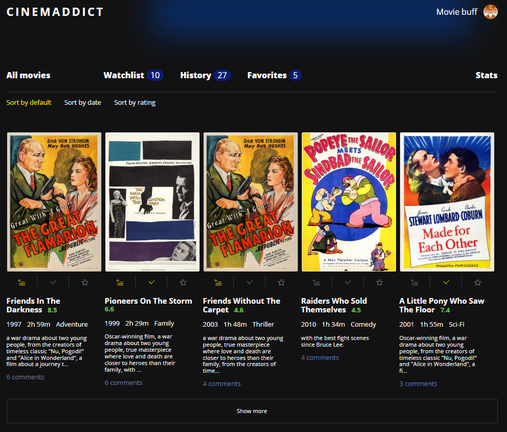
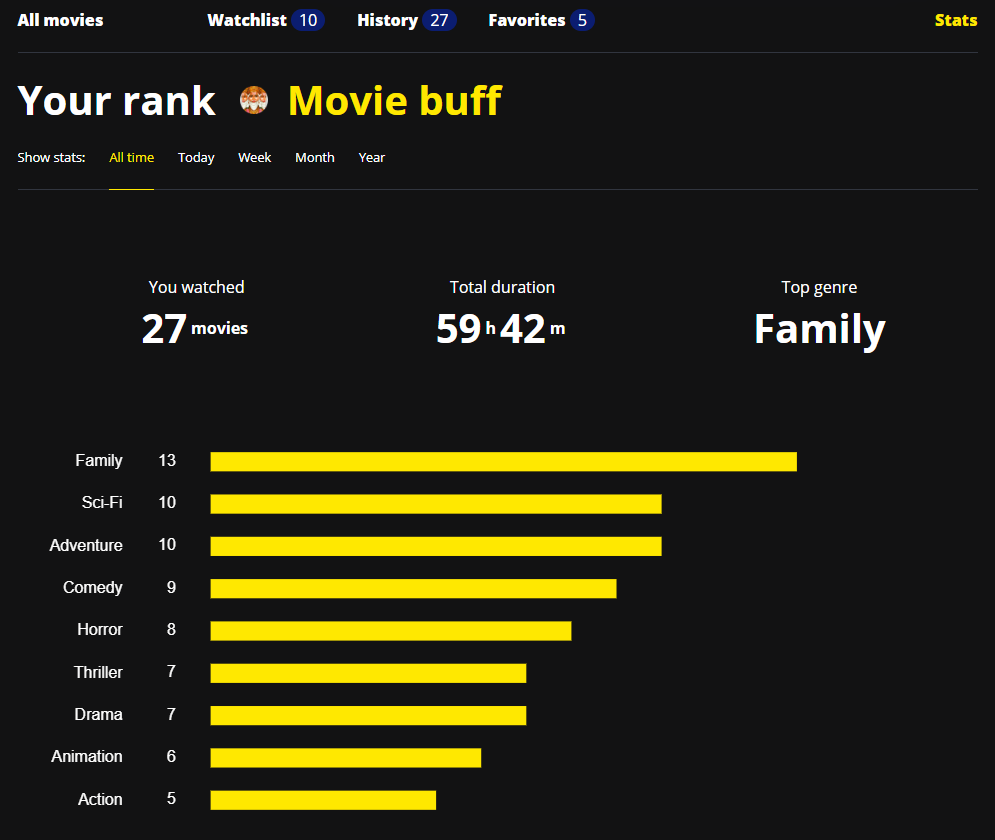
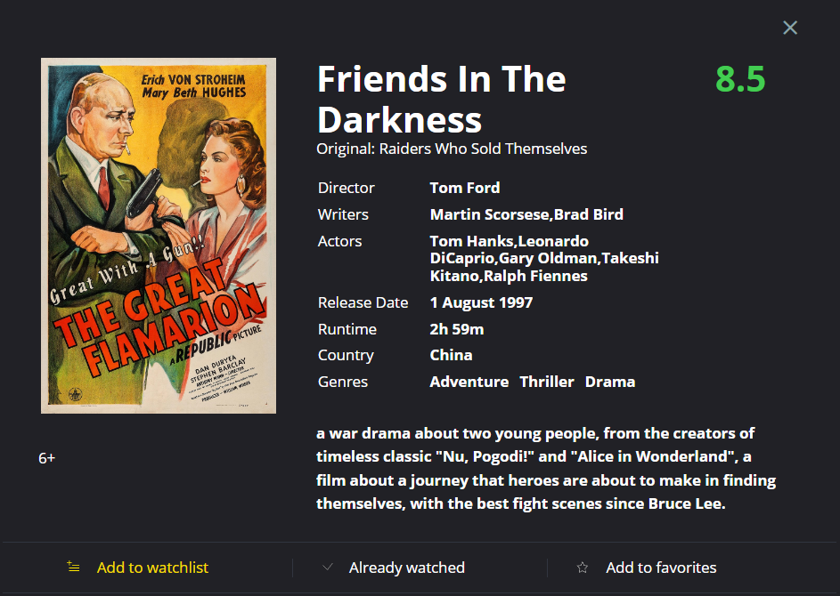
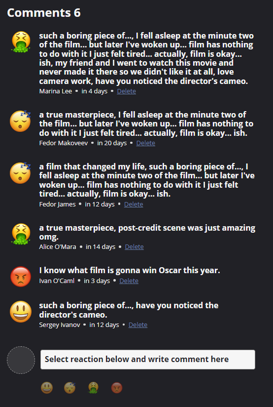

# Проект «Киноман»

- Студент: [Павел Ряполов](https://up.htmlacademy.ru/ecmascript/16/user/1217543).
- Наставник: [Игорь Казанцев](https://htmlacademy.ru/profile/id572311).

### О проекте

Проект предназначен для просмотра информации о фильмах, добавлении их в избранное, комментировании.

Стэк: JavaScript, паттерн MVP, ООП

#### Главная страница

#### Страница статистики

Статистика динамически меняется, в зависимости по мере просмотра фильмов.

#### Карточка фильма

#### Форма комментариев

---

Репозиторий создан для обучения на профессиональном курсе «[JavaScript. Архитектура клиентских приложений](https://htmlacademy.ru/intensive/ecmascript)» от [HTML Academy](https://htmlacademy.ru).

[check-image]: https://github.com/htmlacademy-ecmascript/1217543-cinemaddict-16/workflows/Project%20check/badge.svg?branch=master
[check-url]: https://github.com/htmlacademy-ecmascript/1217543-cinemaddict-16/actions
